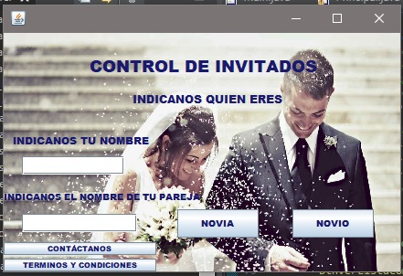
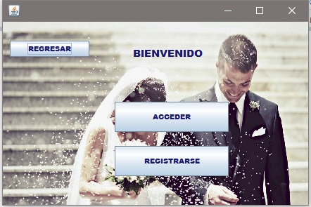
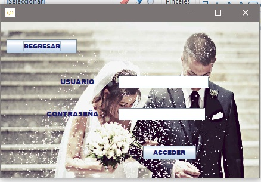
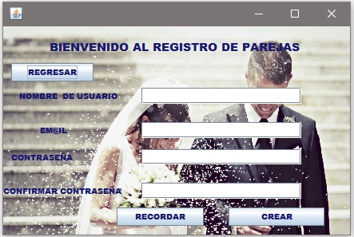
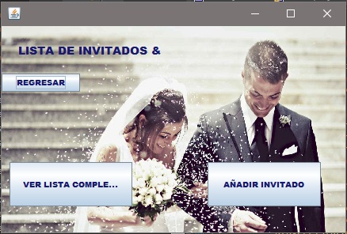
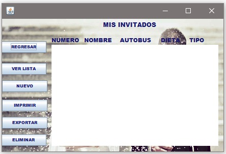
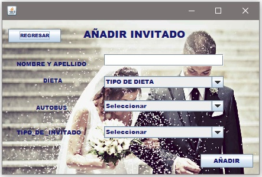

## Proyecto de diseño de una aplicación web para la asignatura **Programacion** curso **2019-2020**

> Nombre de la aplicación: **MY Wedding List**

> Nombre del alumno: **[Berny Jimenez](https://www.linkedin.com/in/berny-jiménez-7027a7177)**

## Clase control de invitados

## Clase Bienvenida

## Clase Acceso Usuario Registrado

## Clase Registro de Usuarios

## Clase Lista de invitados Añadir/Verlista

## Clase Mis Invitados

## Clase Añadir Invitado

