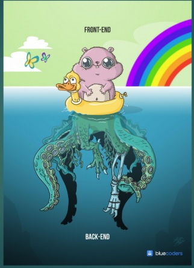

# Programacion-MyWeddingList

## Proyecto de diseño de una aplicación web para la asignatura **Programacion** curso **2019-2020**

> Descripcion

* En la carpeta Entrega se encuentra el proyecto a entregar en el cual tambien se encuentra un mockup con imagenes del proyecto desplegado
* y su forma visual para el usuario, al tratarse de mi primer proyecto he decidido incluir en la rama master de lo que seria este proyecto 
* el cual seria de forma visual muy llamativo pero con un codigo un poco complejo al abrir diferentes ventanas e implementar JFrame 

> Nombre de la aplicación: **MY Wedding List**

> Nombre del alumno: **[Berny Jimenez](https://www.linkedin.com/in/berny-jiménez-7027a7177)**

## My Wedding List 
> **Prototipo Back-End y Front-End**

